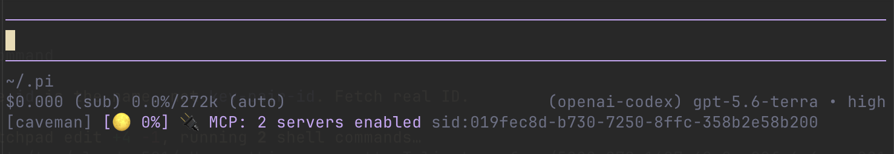

# Pi configuration

Personal [Pi](https://github.com/badlogic/pi-mono) agent configuration, managed as dotfiles.

## Highlights

- Catppuccin Mocha theme
- Default model: OpenAI Codex GPT Terra or Anthropic Claude Sonnet equivalent
- High thinking level, visible thinking blocks, compaction, retries, and caching
- Claude and OpenAI Codex models
- Telemetry disabled
- User-only session-tree filter

## Customizations

### Extensions

- **Caveman mode** — auto-enabled terse responses; toggle with `/caveman on|off`.
- **Context moon** — accent-colored moon-phase gauge tracks context-window usage in footer.
- **Session ID** — full session UUID in footer for quick reference.
- **Side chat** — `/btw [question]` opens a context-aware, read-only side conversation without growing main history.
- **Prompt stash** — queue drafts with `Ctrl+s`, restore with `Ctrl+Shift+s`, or manage via `/stash`.
- **Double paste expansion** — large pastes collapse; paste same clipboard text again to expand it.
- **Command aliases** — `/clear` → `/new`; `/rename` → `/name`.
- **Dangerous command guard** — parses agent-issued shell with Tree-sitter, then blocks destructive
  operations such as `rm -rf`, Terraform apply/destroy, hard resets, unsafe cleans, protected-branch
  force-pushes, and hook bypasses; installs pinned parser dependencies automatically on first load.
- **Ready notifications** — terminal bell and macOS chime when agent finishes; no desktop notifications.
- **cmux integration** — reports Pi lifecycle and tool activity for idle detection, notifications, Feed telemetry,
  and session restore.
- **Automatic session names** — generates a concise name from the first prompt using the cheapest available model.
- **Title-bar spinner** — shows agent activity, session name, and working directory in terminal title.

### Interface

- **Theme:** Catppuccin Mocha dark palette with markdown, syntax, diff, tool, and thinking-level colors.
- **Model cycling:** `Shift+Ctrl+P` or `Ctrl+N`; scoped models stay grouped by provider and ordered from
  cheaper/lighter to costlier/stronger.
- **Model/session save or sort:** `Alt+S`.

## Packages and extensions

### Git packages

- [`thiagowfx/skills`](https://github.com/thiagowfx/skills)
  - PR review-comment handling
  - Blog drafting
  - Repository catch-up and handoffs
  - GitHub Actions failure analysis
  - Design grilling, TDD, APKBUILD scaffolding
  - PR shipping and CI-pass loops

### npm packages

- `@nerisma/pi-auto-title` — generates concise session names from first prompts using a cheap model.
- `@mrclrchtr/supi-prompt-suggestions` — advisory ghost-text follow-up prompt suggestions.
- `@narumitw/pi-goal` — persistent, verifiable autonomous goal completion with `/goal`.
- `@zeldrisho/pi-web-fetch` — keyless, bounded public webpage fetching through sole `web_fetch` tool.
- `pi-tool-display` — OpenCode-style compact tool rendering and richer edit diffs.
- `@tifan/pi-recap` — session recap generation.
- `@tintinweb/pi-subagents` — specialized subagents.
- `pi-mcp-adapter` — lazy MCP server integration through one context-efficient proxy tool.

### Local packages

- `pi-memory-async` — persists exit-summary jobs and writes durable daily memory asynchronously on a later session.
- `web-search` — keyless web discovery via Jina Reader and DuckDuckGo; adapted from
  [`pasky/pi-amplike`](https://github.com/pasky/pi-amplike) under MIT license.

## Layout

- `agent/AGENTS.md` — global instruction source of truth; `~/.claude/CLAUDE.md` links to it.
- `.config/mcp/mcp.json` — shared MCP server configuration.
- `agent/settings.json` — Pi settings and packages.
- `agent/keybindings.json` — keybindings.
- `agent/extensions/` — custom TypeScript extensions.
- `agent/themes/` — custom themes.
